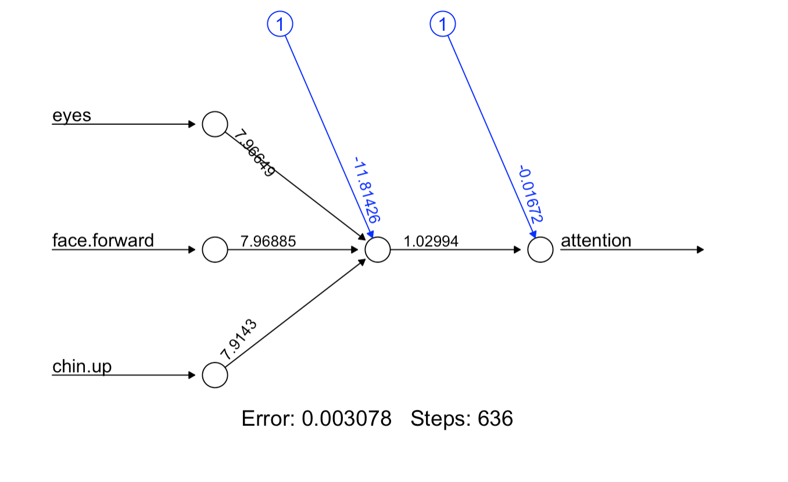
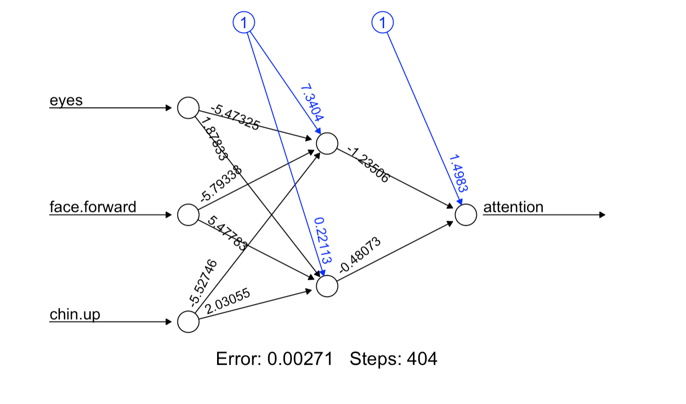

# Neural-Networks
Neural networks are not a new method, the first artificial neural network was devised in 1943, but advances in computational power and speed have made them a much more viable strategy for solving complex problems over the last 5-10 years. Originally devised by mathmaticians and neuroscientists to illustrate the fundamental principles of how brains might work they lost favor in the second half of the 20th century only to surge in popularity in the 20-teens as software engineers used them to resolve mathmatically intractable problems. The application of neural networks to learning problems has been ongoing for 20 years, often to predict student behvior or to parse unstructured data such as student writing samples and provide natural sounding feedback through AI avatars.

